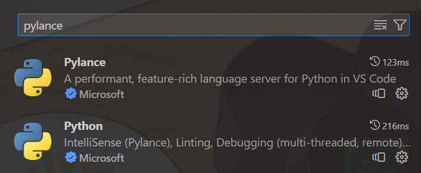
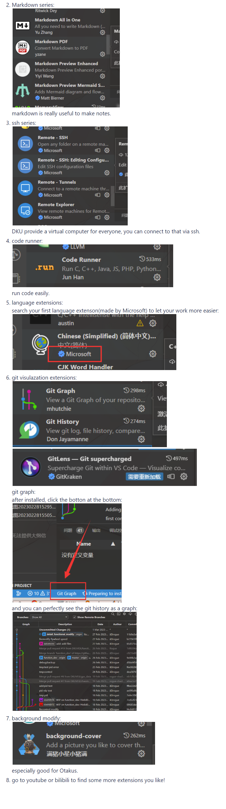

# introduction
Recommand work pipeline in windows:
gitbash/powershell + miniconda + vscode(with extensions)
## Installation
1. install miniconda: https://docs.conda.io/projects/miniconda/en/latest/
2. install vscode: https://code.visualstudio.com/
3. recommended vscode extensions: 
   1.   
   2.   
## Usage
1. conda: https://docs.conda.io/projects/conda/en/latest/user-guide/index.html
## notes
1. try to learn and use basic commands.
2. try to use conda to manage your python environments.
3. try to read error information if you meet mistake.
